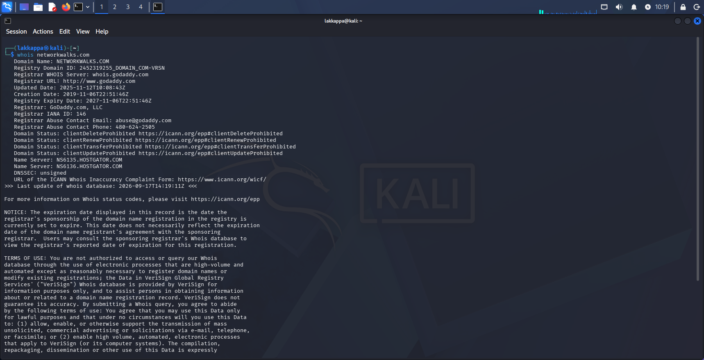
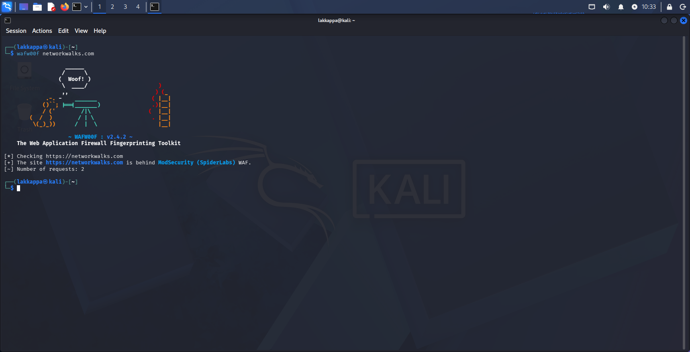
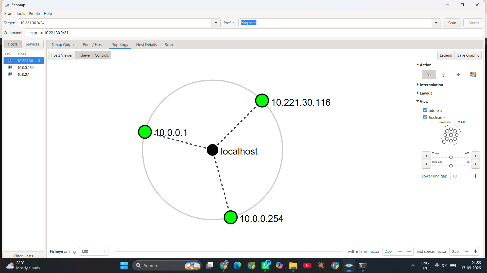
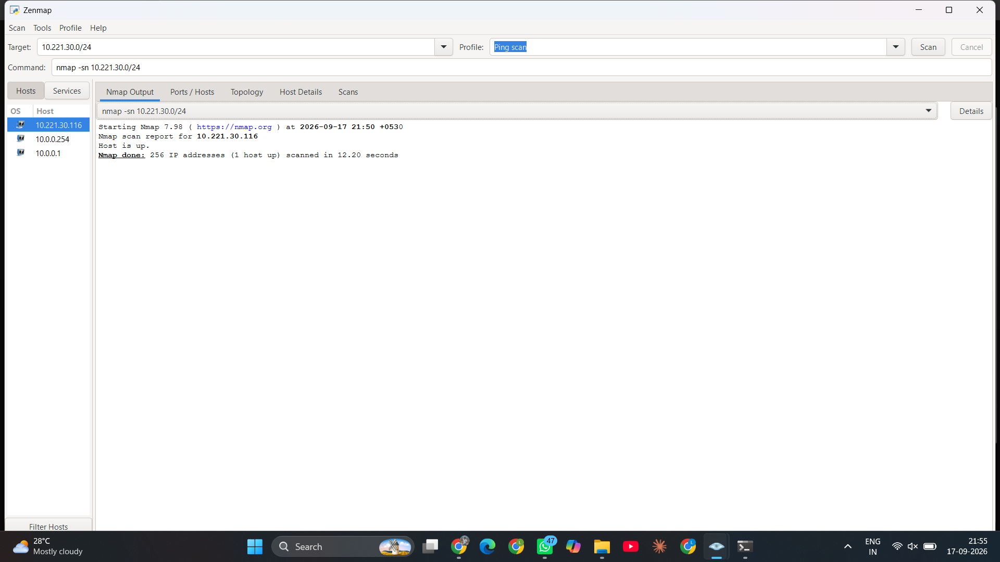

# 🕵️ Footprinting, Reconnaissance & Network Scanning — Week 2

**Passive footprinting of a live target with six Kali Linux tools, plus active host discovery with Zenmap**


---

## 📌 Project Overview

This project covers **Week 2** of the Networkwalks Academy Cybersecurity & Ethical Hacking curriculum, combining two project modules:

- **W2-PM1 — Footprinting & Reconnaissance with Multiple Kali Tools:** passive information gathering against the live public target `networkwalks.com` using six built-in Kali Linux tools.
- **W2-PM5 — Network Scanning with Zenmap:** active host discovery on a local network subnet using the Zenmap GUI (the official graphical front-end for Nmap).

Together these two modules represent the first stage of any real security assessment: understanding a target from the outside (footprinting) and understanding what's alive on a network (scanning) — all before any exploitation is attempted.

> ⚠️ `networkwalks.com` is the course's own public-facing training domain, explicitly provided by the instructor as an authorized recon target. All commands here are **passive, read-only reconnaissance** — no exploitation was performed.

---

## 🎯 Objectives

- Run `whois` to identify domain ownership, registrar, and name servers.
- Run `whatweb` to fingerprint the web server, CMS, and plugin versions in use.
- Run `nslookup` to resolve the domain to its IP address via DNS.
- Run `curl -I` to inspect HTTP response headers, cookies, and redirects.
- Run `wafw00f` to detect whether a Web Application Firewall is protecting the site.
- Run `dnsrecon` to enumerate the target's full DNS record set (NS, MX, TXT, SRV).
- Install and use **Zenmap** to discover live hosts on a local subnet.
- Identify the number, IP addresses, and MAC addresses of live hosts found.
- Export the scan topology as a PDF for reporting.

---

## 🛡️ Purpose

Reconnaissance (footprinting) is the first phase of every real attack or authorized penetration test. Before touching a target directly, an attacker (or a defender testing their own exposure) quietly collects everything that is *already public*: who owns the domain, its real IP address, its hosting provider, the exact software versions it runs, its DNS/mail infrastructure, and whether a firewall is watching. None of the tools used here send exploit traffic — they only read what the target has already made public — which is exactly what makes footprinting so powerful and so difficult to detect.

Network scanning with Zenmap complements this by identifying what is *actually reachable* on a given network segment — a necessary step before any internal assessment can begin.

> ⚠️ **This lab is for educational purposes only.** Every tool here was run against either the course's own authorized public training domain or the author's own local lab network. None of these techniques should be used against any system without explicit written authorization.

---

## ⚙️ Environment

| 🧩 Component        | ⚙️ Details                              |
|----------------------|--------------------------------------------|
| 🐉 Attack Platform   | Kali Linux                                  |
| 🎯 Recon Target      | `networkwalks.com` (authorized training domain) |
| 🌐 Scan Subnet       | `10.221.30.0/24` (local lab network)        |
| 🧰 Tools Used        | whois, whatweb, nslookup, curl, wafw00f, dnsrecon, Zenmap/Nmap |

---

# 🔎 Module 1 — Footprinting & Reconnaissance (W2-PM1)

Six Kali Linux tools were used to build a complete external profile of `networkwalks.com`, without sending a single exploit or attack packet.

## Task 1 — WHOIS Domain Lookup

**Command:** `whois networkwalks.com`

Queried the public domain registration record to identify the registrar, registration/expiry dates, and authoritative name servers.


*whois showing registrar GoDaddy.com LLC, domain created 2019-11-06, expiring 2027-11-06, and name servers pointing to `ns6135.hostgator.com` / `ns6136.hostgator.com`.*

**Findings:**

| Field              | Value                          |
|--------------------|----------------------------------|
| Registrar          | GoDaddy.com, LLC                |
| Creation Date      | 2019-11-06                      |
| Expiry Date        | 2027-11-06                      |
| Last Updated       | 2025-11-12                      |
| Name Servers       | NS6135 / NS6136.HOSTGATOR.COM   |
| DNSSEC             | Unsigned                        |

**How an attacker uses this:** the name servers immediately reveal HostGator as the hosting provider, and the registrar's abuse contact can be used for social-engineering or takedown-avoidance planning.

---

## Task 2, 3 & 4 — Web Fingerprinting, DNS Resolution & HTTP Headers

Three tools were run back-to-back to build a technical fingerprint of the live site.

**Commands:**
```
whatweb networkwalks.com
nslookup networkwalks.com
curl -I https://networkwalks.com
```


*whatweb identifying Apache, WordPress 7.1, WordPress Download Manager 3.3.58, and jQuery 3.7.1; nslookup resolving the domain to `192.232.216.135`; curl returning `HTTP/2 200` with WordPress REST API and caching headers exposed.*

**Findings:**

| Tool      | Key Result                                                                 |
|-----------|------------------------------------------------------------------------------|
| `whatweb` | Apache web server; **WordPress 7.1**; WordPress Download Manager 3.3.58; Bootstrap 7.1; jQuery 3.7.1; email `info@networkwalks.com` exposed |
| `nslookup`| Resolves to `192.232.216.135` (IPv6: `64:ff9b::c0e8:d887`)                  |
| `curl -I` | `HTTP/2 200`; server `Apache`; `x-nginx-cache: WordPress`; WordPress REST API endpoint (`/wp-json/`) disclosed in the `link` header; session cookie `__wpdm_client` set |

**How an attacker uses this:** exact CMS and plugin versions (WordPress 7.1, WP Download Manager 3.3.58) can be checked directly against public vulnerability databases (e.g., CVE/NVD) for known exploits — all without loading a single page in a browser.

---

## Task 5 — Web Application Firewall Detection

**Command:** `wafw00f networkwalks.com`


*wafw00f identifying that `https://networkwalks.com` is protected by **ModSecurity (SpiderLabs)**, using only 2 requests.*

**Finding:** the site sits behind a **ModSecurity (SpiderLabs)** Web Application Firewall.

**How an attacker uses this:** knowing a WAF is present changes the entire approach to a web assessment — naive payloads will be blocked or logged, so an attacker (or tester) must adapt encoding, timing, or evasion techniques accordingly.

---

## Task 6 — Full DNS Enumeration

**Command:** `dnsrecon -d networkwalks.com`


*dnsrecon enumerating SOA, NS, MX, TXT (SPF + Google site-verification), and SRV records — 16 records found in total, including cPanel autodiscover service records.*

**Findings:**

| Record Type | Detail                                                                      |
|-------------|-------------------------------------------------------------------------------|
| SOA / NS    | `ns6135.hostgator.com`, `ns6136.hostgator.com` — running **BIND 9.16.23-RH** |
| MX          | `mail.networkwalks.com` → `192.232.216.135`                                  |
| TXT (SPF)   | `v=spf1 +a +mx +ip4:50.87.144.87 +include:websitewelcome.com ~all`            |
| TXT         | Google site-verification token                                                |
| SRV         | 16× `_autodiscover._tcp` records pointing to `cpanelemaildiscovery.cpanel.net` (IPv4 & IPv6) |

**How an attacker uses this:** the DNS software version (BIND 9.16.23), SPF policy, and cPanel autodiscover records together map the target's entire email and hosting infrastructure — each record is a potential foothold or pivot point for further investigation.

---

## 📊 Module 1 Summary — Full Target Profile

| Attribute            | Value                                             |
|------------------------|-----------------------------------------------------|
| Domain                 | networkwalks.com                                     |
| Registrar               | GoDaddy.com, LLC                                     |
| Hosting Provider        | HostGator                                            |
| Public IP               | 192.232.216.135                                      |
| IPv6                    | 64:ff9b::c0e8:d887                                   |
| Web Server              | Apache                                               |
| CMS                     | WordPress 7.1 (+ WP Download Manager 3.3.58)         |
| DNS Software            | BIND 9.16.23-RH                                      |
| WAF                     | ModSecurity (SpiderLabs)                             |
| Mail Server             | mail.networkwalks.com (cPanel autodiscover, 16 SRV records) |

This is the exact kind of profile an attacker builds *before* ever touching the target directly — and exactly what a defender should review periodically to understand their own public exposure.

---

# 🌐 Module 2 — Network Scanning with Zenmap (W2-PM5)

**Zenmap**, the official GUI front-end for Nmap, was used to discover live hosts on the local lab subnet `10.221.30.0/24`.

## Setup

- Downloaded and installed Zenmap from the official source: <https://nmap.org/download.html>
- Identified the local IP address and subnet using `ipconfig` (Windows) prior to scanning.

## Host Discovery — Ping Scan

**Target:** `10.221.30.0/24` &nbsp;|&nbsp; **Profile:** Ping scan &nbsp;|&nbsp; **Command:** `nmap -sn 10.221.30.0/24`


*Nmap Output — scan of 256 IP addresses in the `10.221.30.0/24` range completed in 12.20 seconds, reporting **1 host up**: `10.221.30.116`.*

**Result:**

```
Starting Nmap 7.98 ( https://nmap.org ) at 2026-09-17 21:50
Nmap scan report for 10.221.30.116
Host is up.
Nmap done: 256 IP addresses (1 host up) scanned in 12.20 seconds
```

## Topology View

Switching to the **Topology** tab visualizes every host Zenmap has discovered in the current session (including hosts found in earlier scans on other lab subnets), fanned out from `localhost` at the center.


*Topology view — `localhost` connected to `10.221.30.116` (this scan's live host), plus `10.0.0.1` and `10.0.0.254`, retained in the same Zenmap session from earlier scanning activity on the lab's other subnet.*

## 📊 Module 2 Findings

| Question                              | Answer                                                        |
|-----------------------------------------|------------------------------------------------------------------|
| Target subnet scanned                   | `10.221.30.0/24`                                                  |
| Hosts live in this scan                 | **1 host** — `10.221.30.116`                                      |
| Additional hosts tracked in session     | `10.0.0.1`, `10.0.0.254` (from prior scans, shown in Topology view) |
| Scan type used                          | Ping scan (`nmap -sn`) — host discovery only, no port scan        |
| Time taken                              | 12.20 seconds for 256 addresses                                   |
| Output exported                         | Topology diagram saved as PDF for the final report               |

**How this is used in practice:** a ping sweep is typically the very first active step of any internal network assessment — it tells a tester exactly which hosts exist before any port scanning or service enumeration is attempted, keeping the assessment efficient and scoped.

---

# 💡 What I Learned

- **Passive vs. active recon:** whois, whatweb, nslookup, curl, wafw00f, and dnsrecon are all *passive* — they only read information the target has already published — while Zenmap's ping scan is an *active* technique that sends packets directly to the target network.
- **Layered footprinting:** no single tool tells the whole story. WHOIS gives ownership and hosting; DNS tools give infrastructure; whatweb and curl give exact software versions; wafw00f tells you what defenses exist — combined, they build a complete external profile.
- **Version disclosure is a real risk:** whatweb exposing WordPress 7.1 and a specific plugin version means anyone can immediately cross-reference public CVE databases — this is a strong practical argument for hiding version banners in production.
- **WAF presence changes the threat model:** knowing ModSecurity sits in front of a site is critical context before attempting any web-layer testing.
- **Zenmap for quick visual recon:** the Topology view turns a flat list of live IPs into an immediately readable map, which is genuinely useful when writing up findings for a client or a report.
- **Documentation discipline:** saving both the screenshot and the raw text output for every command (as required by the lab tasks) is exactly the habit real engagement reports depend on.

---

# 🔐 Security & Ethical Use

This lab is intended **strictly for educational purposes**.

- `networkwalks.com` was used only because it is the course's own authorized public training target — never run these tools against a domain you do not have explicit permission to test.
- The Zenmap scan was run only against the author's own local lab subnet.
- All techniques shown here are passive/read-only (recon) or limited to host discovery (ping scan) — no exploitation, brute forcing, or intrusive scanning was performed.
- Unauthorized reconnaissance or scanning of systems you do not own or have written permission to test is illegal in most jurisdictions, even when no data is altered or damaged.

---

# 🔗 Tools & Resources

- **whois** — domain registration lookup (built into Kali Linux)
- **whatweb** — web technology fingerprinting: <https://github.com/urbanadventurer/WhatWeb>
- **nslookup** — DNS resolution (built into Kali Linux)
- **curl** — HTTP client for header inspection: <https://curl.se>
- **wafw00f** — Web Application Firewall fingerprinting: <https://github.com/EnableSecurity/wafw00f>
- **dnsrecon** — DNS enumeration tool: <https://github.com/darkoperator/dnsrecon>
- **Nmap / Zenmap** — network scanning and the official Nmap GUI: <https://nmap.org/download.html>

---

# 👤 Author

**Lakkappa Padmanna Pujer**
Cybersecurity Learner — Ethical Hacking & Penetration Testing

---

## 📌 Project Information

**Program:** Cybersecurity & Ethical Hacking | **Week:** 02 | **Modules:** W2-PM1 (Footprinting & Reconnaissance) &amp; W2-PM5 (Network Scanning with Zenmap) | **Course Reference:** Networkwalks Academy
